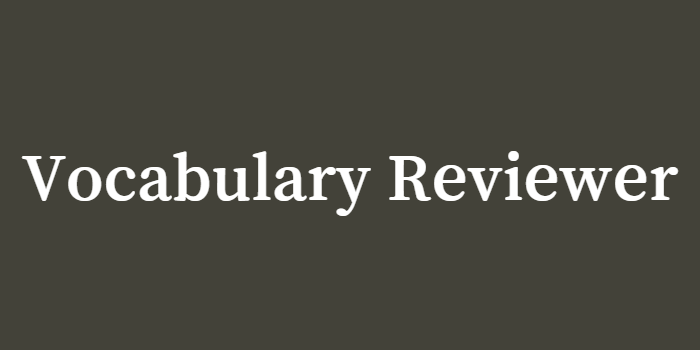

 
 

> ## What it does

This is an app that allows the user to do pronunciation shadowing on vocabulary organized by topic. The user can listen to the work or words and have context by looking at the associated image and repeat the pronunciation of the word. The word pronunciation is produced by the Chromium speech utterance API.

> ## Life demo:

### [English vocabulary reviewer](https://vocabulary-checker.onrender.com/)

### [French vocabulary reviewer](https://french-vocabulary-checker.netlify.app/)

### [Japanese vocabulary reviewer](https://japanese-vocabulary-checker.netlify.app/)

> ## User journey:

### **Home page**:

The user can choose the topic in the home page to move the interface area

### **Interface**:

#### Text section:

This is the word or words to study, you can click on question mark to show the text:

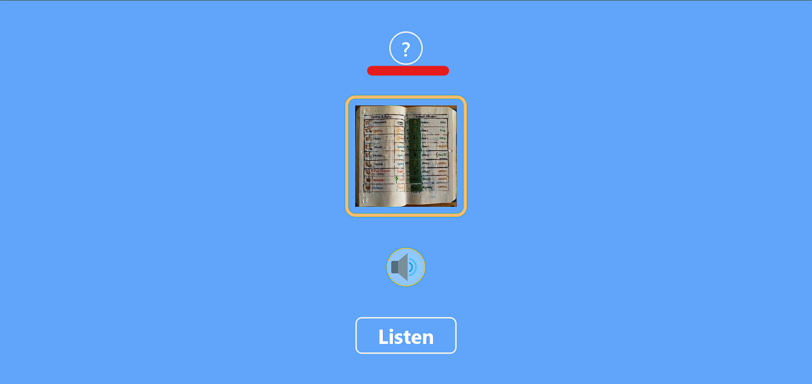

#### Image section:

It shows what the graphic representation of the word or words is:

#### Button section:

It contains the calls to action:

#### Actions area

The speaker button is a speech handler, it triggers the speech and allows the user to change the state from **_Listen_** to **_Next_**:

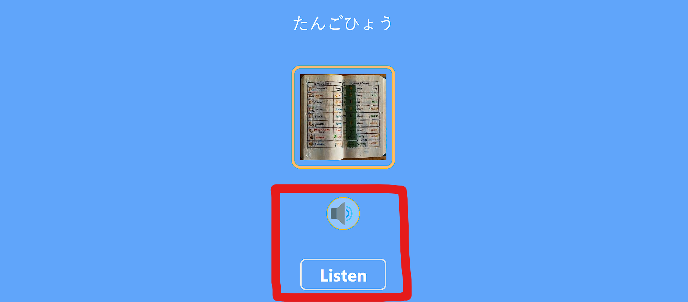
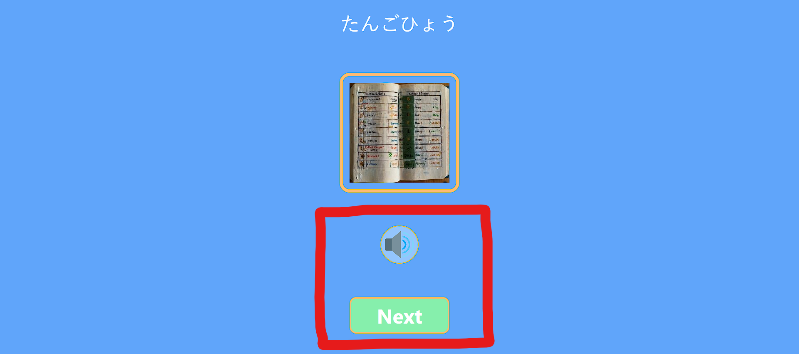

#### Reset / Exit area

Once the user go through all the words for the topic the user can choose between either reset the same topic by clicking on **_Try Again_** or to try other topic by clicking on **_New Exercise_**:

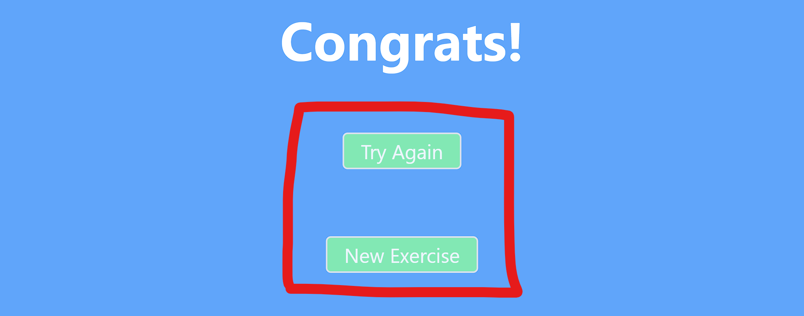

### **Dark mode**:

The user can access dark mode by clicking on the right hand side top corner theme icon:

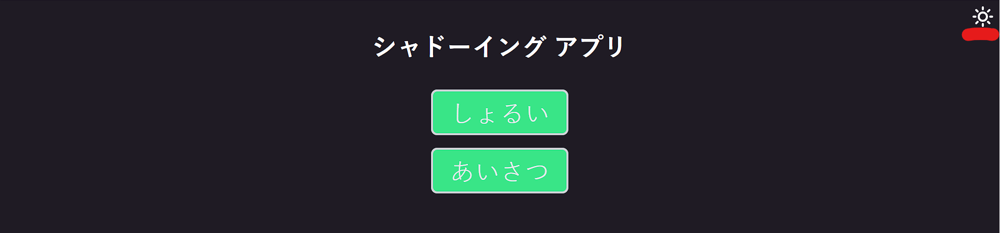

 

> ## Configurations

### **Initial set up**

To get the project started setting up the language please follow this steps

> 1. create a JSON file - meta data object, this is going to be the data source:

- main object keys = topics from origin language, these must be in kebab-case, e.g. **base-instructions**, **basic-greetings** ...

- nested objects keys:

  - translation: topic in target language
  - meta-data: topic meta-data
  - wordsToHighlight: words with special highlighting styles, it is a array index, taking each word as an array element

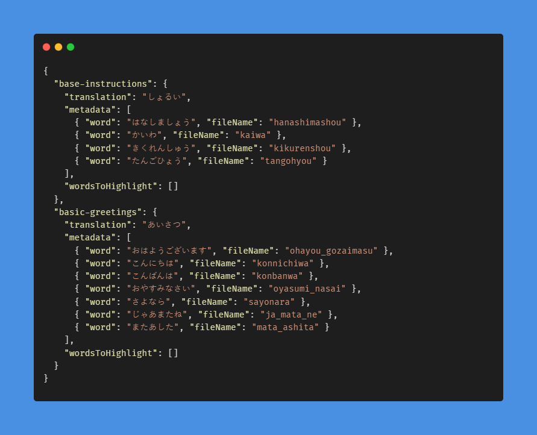

> 2. create an images folder:

The sub-folders must also be in kebab-case, e.g. **base-instructions**, **basic-greetings** since they are referenced in the meta-data json object keys, the images files are referenced in the meta-data objects file name field,

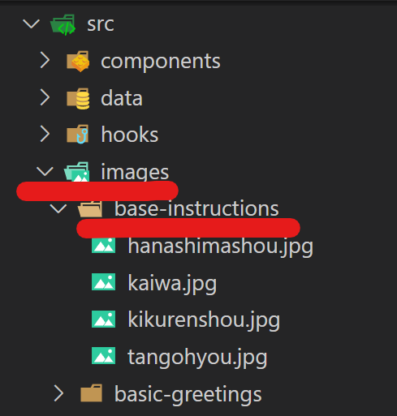

> 3. set the configuration constants file in the config folder:

- First section sets the language
- Second section sets strings for headings and calls to action buttons and links
- Third section sets values for testing, these must be added manually based on the meta-data JSON

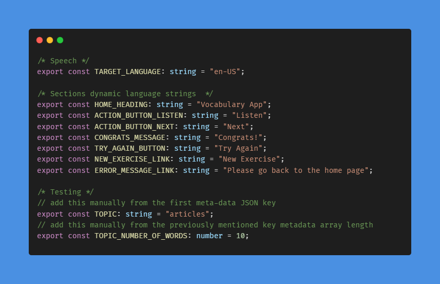

### **npm scripts**

- **Vite**:

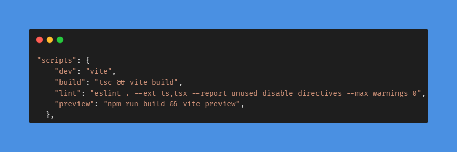

- **Playwright**:

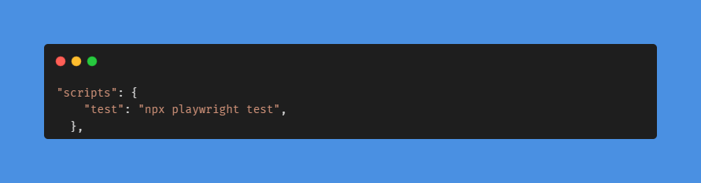

- **Storybook**

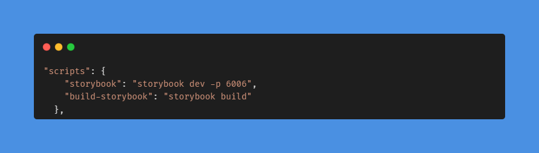

 

> ## Instructions

### **File management**, please organize imports this way:

- library / lib
- components
- hooks
- services / utils
- types

### **Build**

- after each test run **_npm clean_** to remove build files

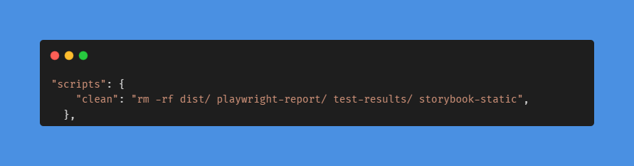

 

> ## Known issues

- **_speech does not work on Firefox_** because it is based on the Chromium speech utterance api

### **Playwright**

- sometimes there is an inconsistently failing test in webkit, then webkit was removed from the testing

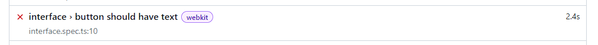

- run on vite preview to get the build code tested

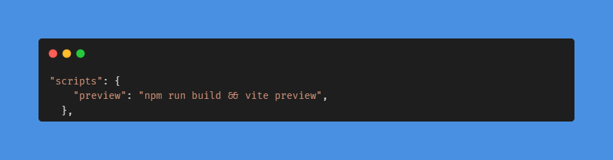

### **Storybook**

types had to be adapted in the dark mode add-on migration

#### preview.ts

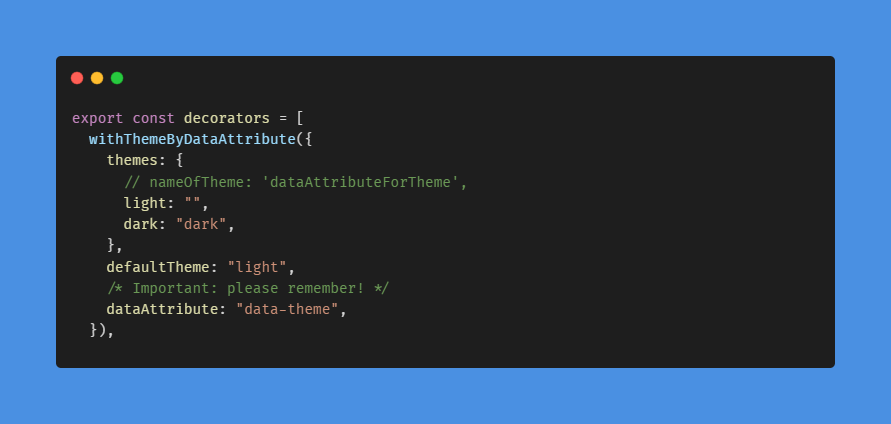

#### index.d.ts

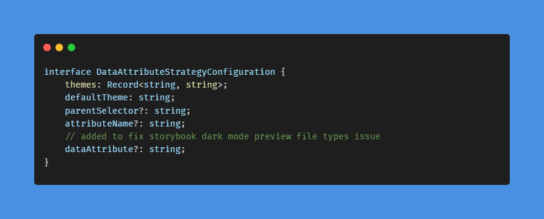
